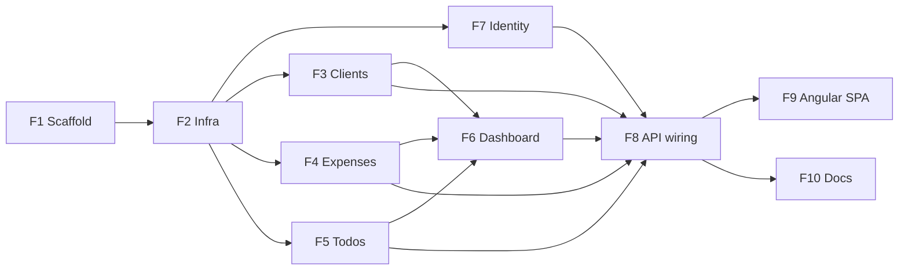

# Project Plan — Factory "الفارس" High-Level Management

> Source artifact: [`IMPLEMENTATION_PLAN.md`](../../../../IMPLEMENTATION_PLAN.md)
> Execution model: **Codex CLI (GPT-5.5)** implements; user/Claude reviews.
> Companion: [`issues-checklist.md`](./issues-checklist.md) — the ordered, Codex-ready task backlog.

---

## 1. Project Overview

### Feature Summary
A high-level management system for factory **الفارس** (Al-Faris). Single-tenant, Arabic-first RTL. Built on the existing **knights-templates** .NET 10 modular-monolith (Minimal APIs, EF Core 10 + PostgreSQL, Mapster, FluentValidation, JWT RBAC). Adds shared grid/chart/export infrastructure, four business modules (Clients, Expenses, Todos, DashboardCharts), an extended Identity module, and a new Angular SPA.

### Business Value
- **Primary Goal:** Give الفارس management one place to manage client accounts, track expenses, run a configurable analytics dashboard, and keep time-restricted to-dos.
- **Success Metrics:** All 6 grid pages live (sort/search/reorder/export); admin can self-define dashboard charts; seeded demo data + admin login work out of the box.
- **User Impact:** Admin/management staff get Arabic RTL grids with PDF/Excel export and a customizable charts dashboard.

### Success Criteria (measurable)
- [ ] `dotnet build` clean; 5 module schemas created via EF migrations.
- [ ] `dotnet run` seeds tenant الفارس + admin + sample rows + 4 default charts.
- [ ] Every grid endpoint: server-side sort, global+per-column search, paging, column-order honored.
- [ ] Every grid page exports the **full filtered set** to xlsx and PDF (RTL Arabic headers).
- [ ] Admin builds a new chart from a grid datasource (type/x/y/agg/colors) and it persists + renders.
- [ ] RBAC enforced: read-only role gets 403 on write/manage.

### Key Milestones (no timelines)
1. **M0 Scaffold** — Factory solution copied, sample modules removed, config set.
2. **M1 Infra** — BuildingBlocks Grids + Charts + Export (the linchpin).
3. **M2 Business modules** — Clients, Expenses, Todos (grids + charts + seed + export).
4. **M3 Dashboard** — DashboardCharts module + registry + default charts.
5. **M4 Identity** — permissions/roles, single-tenant + admin seed, users grid.
6. **M5 API** — wiring, migrations applied, CORS, RTL font.
7. **M6 Frontend** — Angular RTL SPA (grids, dashboard builder, auth).
8. **M7 Docs** — CLAUDE.md + AGENTS.md.

### Risk Assessment
| Risk | Impact | Mitigation |
|---|---|---|
| Hand-rolled grid expression builder mistranslates / injects | High | Strict field allow-list (`GridFieldMap`); unknown field → `Error.Validation`; unit tests for sort/filter/search per op. |
| Cross-module reference creep (Dashboard → Clients) | High | Enforce `IChartDataSource` DI inversion; no `ProjectReference` between modules; reviewer gate. |
| QuestPDF Arabic shaping/RTL renders wrong | Medium | Embed Cairo/Amiri font; register once; visual test on Arabic export. |
| AG Grid server-side row model contract drift vs `GridQuery` | Medium | Freeze `GridQuery`/`PagedResult` DTO first; generate TS types from OpenAPI. |
| EF migration per-module ordering / schema collisions | Medium | One `DbContext` + schema + history table per module; run Identity first. |
| .NET 10 / EF 10 preview API churn | Low | Pin versions in `Directory.Packages.props`. |

---

## 2. Work Item Hierarchy

```mermaid
graph TD
    EPIC[Epic: Factory الفارس Management] --> F1[F1: Solution Scaffold & Config]
    EPIC --> F2[F2: Shared Grid/Chart/Export Infra]
    EPIC --> F3[F3: Clients Management]
    EPIC --> F4[F4: Expenses Management]
    EPIC --> F5[F5: Todos Management]
    EPIC --> F6[F6: Configurable Dashboard]
    EPIC --> F7[F7: Identity, Auth & User Mgmt]
    EPIC --> F8[F8: API Wiring & Migrations]
    EPIC --> F9[F9: Angular RTL SPA]
    EPIC --> F10[F10: Docs & Agent Files]

    F2 --> EN1[Enabler: GridQuery + ApplyGridQuery engine]
    F2 --> EN2[Enabler: IChartDataSource registry contracts]
    F2 --> EN3[Enabler: IGridExporter xlsx/PDF]

    F3 --> S31[Story: Manage clients via grid]
    F3 --> EN31[Enabler: Clients module + ClientsChartDataSource]
    F3 --> T31[Test: grid sort/filter/export]

    F6 --> S61[Story: Admin defines custom chart]
    F6 --> EN61[Enabler: ChartDefinition + registry consumer]
    F6 --> T61[Test: preview + persist + compute series]

    F9 --> S91[Story: Reusable RTL grid component]
    F9 --> S92[Story: Dashboard chart builder UI]
    F9 --> EN91[Enabler: Auth/guards + OpenAPI TS client]
```

---

## 3. Features & Mapping to Source Phases

| # | Feature | Source phase | Component | Priority | Value | Estimate |
|---|---|---|---|---|---|---|
| F1 | Solution Scaffold & Config | Phase 0 | Infrastructure | P0 | High | S |
| F2 | Shared Grid/Chart/Export Infra | Phase 1 | Backend | P0 | High | L |
| F3 | Clients Management | Phase 2 | Backend | P1 | High | M |
| F4 | Expenses Management | Phase 2 | Backend | P1 | High | M |
| F5 | Todos Management | Phase 2 | Backend | P1 | Medium | S |
| F6 | Configurable Dashboard | Phase 3 | Backend | P1 | High | M |
| F7 | Identity, Auth & User Mgmt | Phase 4 | Backend | P0 | High | M |
| F8 | API Wiring & Migrations | Phase 5 | Infrastructure | P0 | High | S |
| F9 | Angular RTL SPA | Phase 6 | Frontend | P1 | High | XL |
| F10 | Docs & Agent Files | Phase 7 | Documentation | P2 | Medium | S |

---

## 4. Priority & Value Matrix (applied)

| Priority | Value | Items |
|---|---|---|
| P0 / High | Critical path | F1 Scaffold, F2 Infra, F7 Identity, F8 API wiring |
| P1 / High | Core user-facing | F3 Clients, F4 Expenses, F6 Dashboard, F9 SPA |
| P1 / Medium | Core internal | F5 Todos |
| P2 / Medium | Important, not blocking | F10 Docs |

---

## 5. Dependency Graph & Critical Path

- **Critical path:** F1 → F2 → (F7 ‖ F3/F4/F5) → F6 → F8 → F9.
- **Parallelizable:** F3, F4, F5 after F2 (independent modules); F7 after F2; F10 after F8.
- **F2 is the linchpin** — nothing grid/chart/export-related can start until its contracts are frozen.

### Dependency types
- **Blocks:** F2 blocks F3/F4/F5/F6; F8 blocks F9.
- **Prerequisite:** F1 (scaffold) before everything; Identity seed before runtime auth.
- **Parallel:** F3 ‖ F4 ‖ F5; F10 ‖ F9.
- **Related:** F6 consumes F3/F4/F5 datasources at runtime (DI), not at build time.

---

## 6. Estimation Summary

| Feature | Stories | Enablers | Tests | Story points |
|---|---|---|---|---|
| F1 | 1 | 1 | 1 | 3 |
| F2 | 0 | 3 | 3 | 13 |
| F3 | 1 | 1 | 1 | 8 |
| F4 | 1 | 1 | 1 | 8 |
| F5 | 1 | 1 | 1 | 5 |
| F6 | 2 | 1 | 1 | 8 |
| F7 | 1 | 2 | 1 | 8 |
| F8 | 0 | 1 | 1 | 5 |
| F9 | 4 | 2 | 1 | 21 |
| F10 | 0 | 1 | 0 | 3 |
| **Total** | | | | **~82** (XL epic) |

---

## 7. Execution Sequencing for Codex CLI

Codex should execute the **ordered task backlog** in [`issues-checklist.md`](./issues-checklist.md) top-to-bottom. The backlog is grouped into the milestones above; each task is INVEST-sized, names the files it touches, and carries acceptance criteria + a Definition of Done so Codex can self-verify before moving on.

**Per-task loop for Codex:**
1. Read the task + its acceptance criteria.
2. Implement only the files listed (respect module isolation — never add a cross-module `ProjectReference`).
3. Apply `dotnet-best-practices` (XML docs on public APIs, primary-ctor DI, async/await, structured logging, SOLID).
4. Build + run the task's verification command.
5. Tick the checkbox; stop at each **REVIEW GATE** for human review.

**Review gates:** after M1 (infra), after first full vertical slice (M2 Clients), after M3 (dashboard), after M6 (frontend).

---

## 8. GitHub Project Board (optional)

If tracked on GitHub: columns **Backlog → Sprint Ready → In Progress → In Review → Testing → Done**; custom fields **Priority (P0–P3), Value, Component (Backend/Frontend/Infra/Docs), Estimate, Epic**. The epic + 10 features + per-task issues map 1:1 to the backlog IDs (E, F1–F10, T001…). Automation YAML samples are in the skill reference; wire only if a GitHub remote exists (this repo is currently local / not a git repo).
